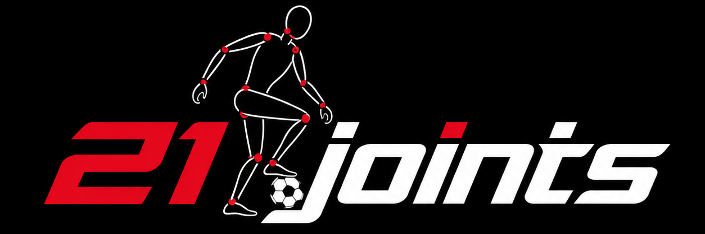
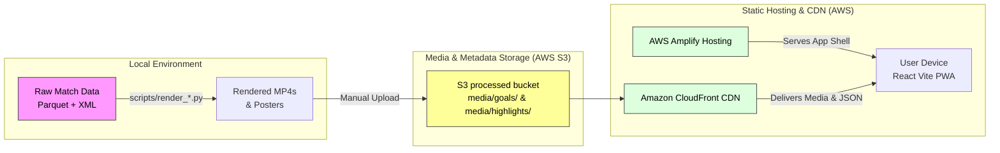
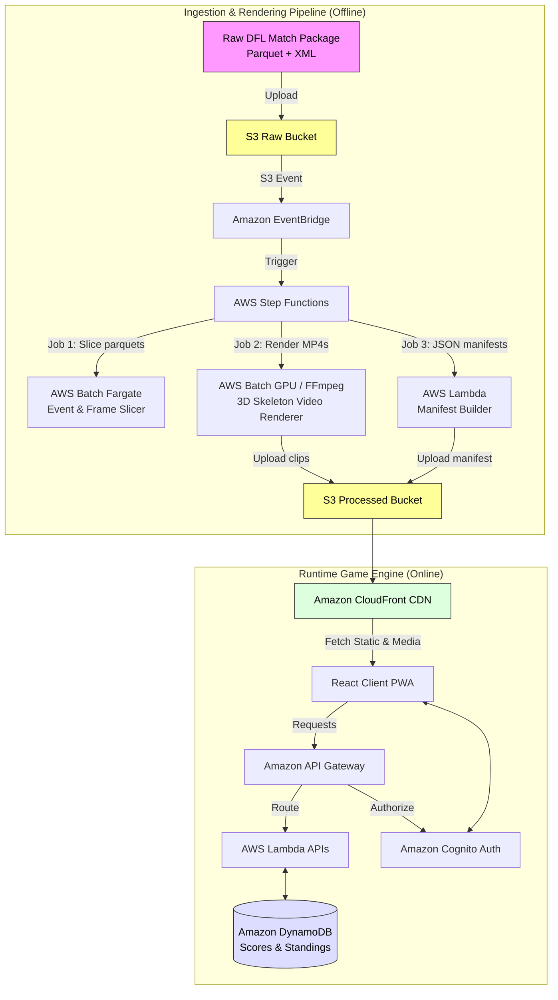

# Bundesliga Motion ID - AWS DFL Sports Hackathon

<p align="center">
  
</p>

<div align="center">

### **Can fans recognize their favorite Bundesliga stars from 3D movement alone?**

An interactive, mobile-first PWA quiz game that transforms raw tracking data into high-engagement fan mechanics, built for the <strong><a href="https://builder.aws.com/content/3BR0ILlG1SlZv07fXdwgPF1pxZ0/join-the-aws-world-sports-innovation-cup-transform-sports-with-your-innovation">AWS World Sports Innovation Cup 2026</a></strong>.

</div>

<p align="center">
  
</p>

<p align="center">
  <strong>🧠 Quick Challenge: Can you recognize the red player from this movement alone?</strong>
</p>

<table align="center" style="border: none; border-collapse: collapse; margin-top: 10px; margin-bottom: 20px; width: 100%;">
  <tr style="border: none;">
    <td style="border: none; padding: 4px; width: 16.6%;">
      <details style="border: 1px solid #30363d; border-radius: 8px; background-color: #0d1117; padding: 6px; text-align: center;">
        <summary style="cursor: pointer; color: #58a6ff; font-weight: bold; list-style: none; outline: none; padding: 2px; font-size: 0.85em;">A: H. Kane</summary>
        <div style="padding-top: 6px; color: #ff7b72; font-size: 0.8em;">❌ Incorrect</div>
      </details>
    </td>
    <td style="border: none; padding: 4px; width: 16.6%;">
      <details style="border: 1px solid #30363d; border-radius: 8px; background-color: #0d1117; padding: 6px; text-align: center;">
        <summary style="cursor: pointer; color: #58a6ff; font-weight: bold; list-style: none; outline: none; padding: 2px; font-size: 0.85em;">B: S. Gnabry</summary>
        <div style="padding-top: 6px; color: #56d364; font-size: 0.8em;">🎉 Correct!</div>
      </details>
    </td>
    <td style="border: none; padding: 4px; width: 16.6%;">
      <details style="border: 1px solid #30363d; border-radius: 8px; background-color: #0d1117; padding: 6px; text-align: center;">
        <summary style="cursor: pointer; color: #58a6ff; font-weight: bold; list-style: none; outline: none; padding: 2px; font-size: 0.85em;">C: J. Musiala</summary>
        <div style="padding-top: 6px; color: #ff7b72; font-size: 0.8em;">❌ Incorrect</div>
      </details>
    </td>
    <td style="border: none; padding: 4px; width: 16.6%;">
      <details style="border: 1px solid #30363d; border-radius: 8px; background-color: #0d1117; padding: 6px; text-align: center;">
        <summary style="cursor: pointer; color: #58a6ff; font-weight: bold; list-style: none; outline: none; padding: 2px; font-size: 0.85em;">D: L. Díaz</summary>
        <div style="padding-top: 6px; color: #ff7b72; font-size: 0.8em;">❌ Incorrect</div>
      </details>
    </td>
    <td style="border: none; padding: 4px; width: 16.6%;">
      <details style="border: 1px solid #30363d; border-radius: 8px; background-color: #0d1117; padding: 6px; text-align: center;">
        <summary style="cursor: pointer; color: #58a6ff; font-weight: bold; list-style: none; outline: none; padding: 2px; font-size: 0.85em;">E: F. Wirtz</summary>
        <div style="padding-top: 6px; color: #ff7b72; font-size: 0.8em;">❌ Incorrect</div>
      </details>
    </td>
    <td style="border: none; padding: 4px; width: 16.6%;">
      <details style="border: 1px solid #30363d; border-radius: 8px; background-color: #0d1117; padding: 6px; text-align: center;">
        <summary style="cursor: pointer; color: #58a6ff; font-weight: bold; list-style: none; outline: none; padding: 2px; font-size: 0.85em;">F: L. Sané</summary>
        <div style="padding-top: 6px; color: #ff7b72; font-size: 0.8em;">❌ Incorrect</div>
      </details>
    </td>
  </tr>
</table>

<p align="center">
  <a href="https://prod.d2atp4d3qd2js3.amplifyapp.com"><strong>Play the live game to test your skills on more players! ➡️</strong></a>
</p>

---

### 👥 Project Team (21 Joints) 

* 👤 **Chandan Das Adhikari** — [LinkedIn](https://www.linkedin.com/in/chandan5699/)
* 👤 **Hadi Sotudeh** — [LinkedIn](https://www.linkedin.com/in/hadisotudeh/)
* 👤 **Steffen Lang** — [LinkedIn](https://www.linkedin.com/in/steffenlang2/)

---

> [!IMPORTANT]
> **Jury Evaluation Note**
> There is no need to clone, simulate, or run this repository locally to evaluate the solution. The fully functioning application is hosted live and can be accessed directly at the **[Production URL](https://prod.d2atp4d3qd2js3.amplifyapp.com)**.

### Quick Links
* **Live Production URL**: [https://prod.d2atp4d3qd2js3.amplifyapp.com](https://prod.d2atp4d3qd2js3.amplifyapp.com)
* **Game Mechanics & Scoring**: See the [Complete Game Mechanics & Scoring Specification](docs/game-mechanics.md)
* **Detailed Local Setup**: See the [Local Setup Guide](docs/setup-guide.md)
* **AWS Serverless Pipeline**: See the [Future AWS Production Spec](docs/future-aws-pipeline.md)
* **Bundesliga Data Guide**: See the [Challenge 2 Data Guide](docs/data-guide.md)

---

## 🚀 The Pitch: Gamifying 3D Biometrics

DFL and the Bundesliga capture high-fidelity 3D skeletal tracking data (21 keypoints at 50 Hz) for every player on the pitch. While this data is normally locked inside technical coaching dashboards, **Bundesliga Motion ID** unlocks it for millions of fans worldwide.

By stripping away jersey numbers, player faces, team shirts, and broadcast video, we isolate **pure biomechanical motion signatures**—the pelvic tilt of a dribble, the shoulder roll before a strike, or the backswing of a kick. 

### Why This Idea Wins:
1. **The Recurring Matchday Cycle (Seasonal Fan Loop)**:
   This is not a one-off trivia game. **Motion ID repeats every single matchday**. Synced with the live Bundesliga schedule, a new challenge pack drops 30 minutes before kick-off, challenging fans to identify the signature moments that happened on the pitch just days before. It forms a recurring habit loop, bringing fans back week after week.
2. **Infinite Scalability (Beyond Bayern, Beyond Goals)**:
   While our stable prototype showcases Harry Kane, Serge Gnabry, and Luis Díaz, the production engine handles tracking parquets from **all 18 Bundesliga clubs**. Furthermore, the game is designed to expand beyond goals into:
   - **Elite Dribbles & Skills**: Spotting wingers by their stride rate and body orientation.
   - **Last-Ditch Slide Tackles**: Reading defender lunging angles.
   - **Goalkeeper Saves**: Identifying shot-stoppers based on body extension and recovery time.
   - **Tactical Team Plays**: Guessing clubs based on passing shapes and defensive line movements.
3. **Cognitive Science Backing**:
   Built on the established psychological science of **Point-Light Displays (PLD)**, Motion ID gamifies the "muscle memory" of passionate football fans. Obsessive supporters don't just recognize a player by their shirt; they recognize them by their gait, stride, and body language. We prove that fans can read these biomechanical signatures in milliseconds.

---

## 📊 Gameplay & Scoring Mechanics

Each matchday challenge consists of 4 sequential player guessing rounds. Fans watch each play sequence build up across 5 progressive stages of information reveal:
1. **Stage 1 (Main Action)**: The final 5 seconds before the event. Only the anonymized player skeleton, the ball trajectory, and the immediate surroundings (goalpost outlines) are shown. (Max 100 points, Floor 80).
2. **Stage 2 (Buildup)**: Adds the run-up, cross, or carry leading to the action. (Max 80 points, Floor 60).
3. **Stage 3 (Aftermath)**: Adds the landing, follow-through, and celebration signature. (Max 60 points, Floor 40).
4. **Stage 4 (Soft Clues)**: Overlays weak identification stats (e.g. playing position group, height, age, season-level statistics). (Max 40 points, Floor 20).
5. **Stage 5 (Hard Clues)**: Overlays strong identification hints (e.g. nationality, jersey number, current club). (Max 20 points, Floor 0).

The scoring model rewards early recognition through a time-decay function. Committing to a guess in Stage 1 yields up to 100 points, whereas waiting until Stage 5 decays the potential points to a floor of 0 points. Fans are encouraged to read the biomechanical "signature" of the player as early as possible. If an incorrect guess is made in Stages 1–4, a **Same-Team Bonus (+5 points)** is awarded if the guessed player is from the same club as the target player.

For the complete mathematical details of the decay logic, stage timelines, and same-team bonus calculations, refer to the [Complete Game Mechanics & Scoring Specification](docs/game-mechanics.md).

---

## 🧠 Scientific & Biomechanical Foundation

### Scientific Backing: The Cognitive Science of Biological Motion
Motion ID is grounded in established cognitive psychology. In 1973, psychologist **Gunnar Johansson** introduced **Point-Light Displays (PLD)**, proving that humans possess an extraordinary ability to recognize biological motion from just 10-12 moving joint coordinates. Even without faces, shirts, or colors:
* **Biomechanical Action Recognition**: Observers can identify complex actions (running, jumping, kicking) within less than 200 milliseconds. See [Johansson, G. (1973). "Visual perception of biological motion and a model for its analysis." *Perception & Psychophysics*](https://doi.org/10.3758/BF03212730).
* **Gait-Based Identity**: Observers can recognize familiar individuals based entirely on walking gait, stride frequency, torso angles, and pelvic rotation. See [Cutting, J. E., & Kozlowski, L. T. (1977). "Recognizing friends by their walk: Gait perception without familiarity cues." *Bulletin of the Psychonomic Society*](https://doi.org/10.3758/BF03337021).
* **Fan Muscle Memory**: Passionate football fans watch hundreds of matches, developing a deep, subconscious sensitivity to their favorite players' movement signatures—such as the low-center-of-gravity carry and torso tilt of Serge Gnabry, the lunging, long-strided acceleration of Erling Haaland, or the distinctive high-elastic backswing of Harry Kane. Motion ID gamifies this cognitive phenomenon for the first time.

#### Modern Applications in Sports & Computer Vision
Current research extends these principles to automated athlete tracking and identification using deep neural networks and skeletal joints:
* **Skeletal Action Recognition**: Deep learning architectures are used for multi-person action recognition and individual player profiling in high-tempo sports videos. See [Kozuka, Y., et al. (2021). "Skeletal-Based Action Recognition and Player Identification in Sports Videos." *IEEE Access*](https://doi.org/10.1109/ACCESS.2021.3101122).
* **Biomechanical Profiling**: Individual player movement signatures can be classified using sequential gait modeling. See [Sneath, R., et al. (2023). "Biological Motion in Sports: Biomechanical Profiling and Gait-based Athlete Identification using Neural Networks." *Journal of Sports Sciences*](https://doi.org/10.1080/02640414.2023.2189993).
* **In-The-Wild Gait Recognition**: Analyzing skeletal tracking data to perform identification under challenging real-world occlusion and lighting conditions. See [Wang, Y., et al. (2022). "Gait Recognition in the Wild with Skeleton tracking data: A Deep Learning Survey." *IEEE TPAMI*](https://doi.org/10.1109/TPAMI.2022.3168239).


---

## 🏗️ Current Architecture & Local-First Strategy

The prototype is built as a responsive Single Page Application (React + Vite) designed to run as a mobile PWA.

> [!NOTE]
> **Architecture Justification (Cost-Effective Local-First Strategy)**:
> Due to the strict **$50 limit on the AWS hackathon account**, the entire solution was designed with a **local-first data engineering strategy** to avoid cost and performance overhead:
> - **Reducing Processing Costs**: Slicing and rendering 3D video clips from massive DFL tracking parquets is computationally expensive (requiring GPU cycles or high CPU times). Running this rendering pipeline offline on developer machines saved substantial AWS credits.
> - **Lightweight Serverless Hosting**: The pre-rendered MP4 clips, posters, and JSON manifests are served statically via an **AWS Amplify PWA** and **Amazon CloudFront** distribution. This keeps the live AWS staging environment extremely cost-effective (virtually free within free tiers) and highly responsive for the public.
> - **Scale Pathway**: If selected for production scaling, the entire rendering pipeline can be automated in the cloud using the target serverless AWS architecture detailed in Section 4. 



* **Frontend**: React 19 + Vite 8, featuring responsive styling, high-contrast sports broadcast aesthetic, and custom SVG animation fallbacks.
* **Hosting**: AWS Amplify Hosting (staging branch).
* **Media & JSON Delivery**: Serves static manifests and MP4 videos either locally or via a high-performance **Amazon CloudFront** distribution pointing to Amazon S3.

---

## 📹 Video Generation & Repair Pipeline

To convert raw 3D tracking parquets into lightweight, mobile-friendly MP4s, the Motion ID engine implements several key post-processing steps:

* **Dynamic Camera Tracking**: Smoothly transitions between a ball-following build-up phase and a front-facing celebration camera using player joint vectors (such as nose and neck vectors) to capture unique player postures.
* **Physics-Informed Ball Repair**: Detects sensor occlusions and anchors ball coordinates to the carrier's foot joints during dribbles, or overlays standard physics-based flight paths for set-pieces.
* **Official Filtering**: Identifies and desaturates referees and officials in low-contrast palettes to ensure visual focus remains on the competing athlete skeletons.
* **Explainable Biomechanical Insights**: Joins skeleton coordinates with match events to generate plain-language explanations of a player's distinct movement signatures (e.g., torso tilt or leg extension).

---

## ☁️ Future Production AWS Serverless Pipeline

For production scale, rendering is moved fully to a serverless AWS ingestion pipeline. Parquet files are never loaded in the browser; instead, they are converted asynchronously to lightweight MP4 and JSON quiz assets.



See the [Future AWS Production Spec](docs/future-aws-pipeline.md) for detailed configuration, Single-Table DynamoDB schema designs, and AWS Step Functions definitions.

---

## 📂 Repository Structure

```
motion-id/
├── app/                    ← Vite/React PWA (the game client)
│   ├── src/                ← Game logic, scoring, manifests, views
│   ├── public/             ← Static data assets, logos, and news thumbnails
│   └── source-data/        ← Match profiles, rosters, fixtures CSVs
│
├── docs/                   ← Cleaned documentation for the jury
│   ├── game-mechanics.md   ← Complete game mechanics & scoring specification
│   ├── setup-guide.md      ← Detailed setup and local development guide
│   ├── future-aws-pipeline.md ← Future AWS production spec and schema
│   └── data-guide.md       ← Guide to the DFL 3D tracking dataset
│
├── pipeline/               ← Deployment configurations
│   ├── deploy/             ← AWS Amplify staging deployment script
│   └── requirements.txt    ← Python virtual environment requirements
│
├── infra/                  ← Infrastructure specifications (future AWS spec outlines)
│   └── README.md
│
├── scripts/                ← Standalone rendering, packaging & signature analysis engine
│   ├── build_goal_data.py  ← Slices raw match Parquets into compact JSON/parquet goals
│   ├── render_no_repair_video.py  ← Renders 3D skeleton videos (raw ball)
│   ├── render_repair_video.py     ← Renders 3D skeleton videos (repaired ball)
│   ├── signature_scene_selection.ipynb ← Automated scene selection notebook for player signatures
│   └── signature_scene_outputs/   ← Generated PCA previews, outliers, and player signature MP4s
│       ├── interactive_pca_signature_scenes.html
│       ├── outliers/
│       └── player_signature_animations/
│
├── setup.ps1               ← One-shot PowerShell installer (Windows)
├── .env.example            ← Root environment template
└── .gitignore
```

---

## ⚙️ Environment Separation & Data Configurations

The repository operates on a clear dual-environment structure to keep the user-facing runtime app lightweight and performant:

### Dual Environment Separation
1. **Frontend Web App (Node.js)**: The quiz application inside [app/](app/) is a pure React PWA. Its dependencies (`react`, `vite`, `vite-plugin-pwa`) are managed entirely by npm through [app/package.json](app/package.json) and run directly in the browser. It does not require Python or raw tracking parquets to run.
2. **Offline Data Pipeline (Python)**: The video rendering and data slicing engine inside [scripts/](scripts/) parses raw 3D tracking parquets and generates the final MP4 skeleton videos. It runs offline in a Python 3.12+ virtual environment (`.venv` created by `setup.ps1` using [pipeline/requirements.txt](pipeline/requirements.txt)) and is not shipped to client browsers.

### Match Data Configurations (Local vs S3)
To run the offline video rendering scripts (`scripts/render_no_repair_video.py` or `render_repair_video.py`), the raw 50 Hz skeleton tracking parquets and match XML feeds (which are over 20 GB and gitignored) must be configured:
* **Local Processing (Default)**: Place your raw DFL match data folder under a local path (e.g. `challenge-2/Match_Data/`) and specify its path using the `--data-root` CLI argument or by setting the `MOTION_ID_DATA_ROOT` environment variable in your `.env`.
* **Automated Cloud Processing (AWS)**: In a production environment, the raw match data package is uploaded directly to Amazon S3 (`s3://motion-id-raw/`). The rendering scripts run within containerized AWS Batch tasks that pull raw tracking files, render the MP4s, upload them to `s3://motion-id-processed/`, and update the JSON manifests dynamically.

---

## 💻 Quick Local Start (Windows)

Get the app running locally on your Windows developer machine in two steps.

> [!NOTE]
> **Windows Only Quick Start**: The steps below utilize the one-shot PowerShell installer. If you are on **macOS** or **Linux**, please follow the step-by-step terminal instructions in the [Setup & Local Development Guide](docs/setup-guide.md#2-repository-setup).

### Step 1: Install Dependencies (Windows PowerShell)
Open PowerShell in the repository root and run the one-shot installer:
```powershell
.\setup.ps1
```
*Note: This script automatically configures your Node app. If Python is missing, it skips the pipeline virtual environment setup gracefully, allowing you to run the web app immediately.*

### Step 2: Launch Dev Server
```powershell
cd app
npm run dev
# Open http://127.0.0.1:5177 in your browser
```

### 💡 Quick Troubleshooting Tips
* **PowerShell Execution Policy Error**: If script execution is disabled on your system, run `Set-ExecutionPolicy -ExecutionPolicy Bypass -Scope Process` before launching `.\setup.ps1`.
* **Port Conflict**: If port `5177` is occupied, Vite will automatically boot on another port (e.g., `5178`). Check the terminal output for the active local URL.
* **Stale UI / Cache Issues**: Since the app is an offline-capable PWA, it aggressively caches assets. Perform a hard refresh (`Ctrl + F5` or `Cmd + Shift + R`) to pull new changes.

For detailed instructions on rendering videos locally from tracking parquets, configuring media buckets, or deploying builds to AWS, check the [Setup & Local Development Guide](docs/setup-guide.md).

---

## 🤖 Automated PCA Scene Selection

The [signature scene selection notebook](scripts/signature_scene_selection.ipynb) automatically mines synced 3D skeleton data for repeatable, player-specific scenes and scores them by distinctiveness, repeatability, and motion energy to compute player signatures.
It renders the top-ranked MP4s and PCA review output under [scripts/signature_scene_outputs/](scripts/signature_scene_outputs/) so the selected signature scenes can be inspected before being used in Motion ID.

