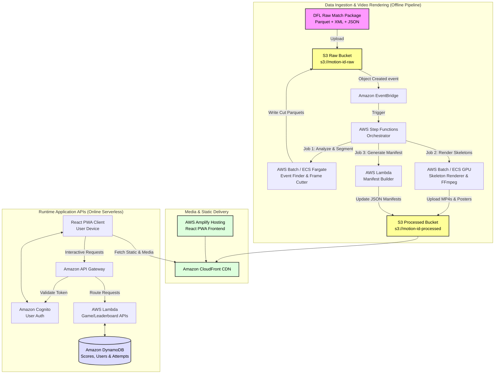

# Motion ID — Future AWS Production Pipeline & Architecture

This document outlines the end-state production architecture for the **Bundesliga Motion ID** quiz platform. It transitions the current manual, developer-driven rendering and copying process into a fully automated, scalable, and secure AWS infrastructure.

> [!NOTE]
> **Why a Target Architecture?**
> Due to the **$50 limit on the AWS hackathon account**, the active staging setup uses a cost-effective hybrid model (rendering videos locally on developer hardware to avoid costly GPU/CPU cloud fees on huge raw data packages, and deploying the frontend statically to AWS Amplify). This document specifies the fully cloud-native target architecture designed to automate and scale the pipeline for production if required.

---

## 1. High-Level Production Architecture

In production, the architecture is split into two distinct layers:
1. **The Ingestion & Processing Pipeline (Offline)**: Processes massive DFL match data packages, detects goal/save events, and renders the 3D skeleton videos.
2. **The Runtime Application (Online)**: Serves the mobile-first React PWA, validates user answers, computes scores, and manages real-time leaderboards.

---

## 2. Ingestion & Processing Pipeline (Offline)

A single Bundesliga match package contains around **140 million data points** and consumes over **4 GB** of space. Loading or querying these files directly in a browser is impossible. The offline pipeline processes these packages asynchronously.

### Step-by-Step Processing Flow

1. **Upload & Trigger**:
   - A new DFL match directory (XML lineups, KPI data, event streams, and the massive 50 Hz skeleton Parquet) is uploaded to `s3://motion-id-raw/match-data/`.
   - Amazon S3 emits an `ObjectCreated` event to **Amazon EventBridge**.
   - EventBridge triggers an **AWS Step Functions** state machine to orchestrate the pipeline.

2. **Analysis & Window Segmentation**:
   - Step Functions runs a lightweight containerized job on **AWS Batch (ECS Fargate)**.
   - The job parses the `kpi_data_*.xml` file to find key event candidates (such as `ShotAtGoal` where `ShotResult = Goal`).
   - It extracts the frame markers (`SyncedFrameId`) for the goal window (10 seconds before the shot, 5 seconds after).
   - It slices the master Parquet tracking data around those frames, creating compact, segmented Parquets for each goal.

3. **3D Skeleton Video Rendering**:
   - Step Functions launches a containerized job on **AWS Batch** using GPU-optimized instances (e.g., `g4dn` series) or CPU instances with multithreaded FFmpeg.
   - The container runs the standalone rendering engine (`render_no_repair_video.py` or `render_repair_video.py`) using the sliced Parquets.
   - It outputs two high-definition MP4 videos for each goal:
     - **No-Repair Video**: Clean 3D skeletons with raw ball coordinates.
     - **Repaired Video**: 3D skeletons with ball-to-foot smoothing and trajectories repaired.
   - It automatically captures a high-resolution poster frame (PNG) at the frame of contact.
   - The rendered MP4s and PNGs are uploaded directly to `s3://motion-id-processed/media/goals/` and `s3://motion-id-processed/media/highlights/`.

4. **Manifest Assembly**:
   - Step Functions invokes an **AWS Lambda** function.
   - The Lambda function merges the event metadata (scorer name, club, match info, xG, distance to goal) with the generated video and image paths.
   - It updates the primary JSON metadata files (`localVideoManifest.json` or `motion-id-demo-manifest.json`) in `s3://motion-id-processed/data/` so the frontend knows a new challenge is ready.

---

## 3. Serverless Runtime Application (Online)

Once processed, the game runs fully serverless, delivering low-latency interactions to users global-wide.

### Infrastructure Components

* **AWS Amplify Hosting**:
  - Serves the static React/Vite PWA.
  - Automatically handles preview branches for pull requests and CI/CD from Git.
  
* **Amazon CloudFront CDN**:
  - Caches and distributes the frontend bundle, JSON manifests, player cards, and rendered MP4 goal clips.
  - Keeps media loading snappy and limits bandwidth charges by caching static assets at edge locations.
  
* **Amazon Cognito User Pools**:
  - Handles secure fan registration, login, and token issuance.
  - Integrates easily with social login providers (such as Google or Apple ID).

* **Amazon API Gateway**:
  - Exposes RESTful endpoints for game logic (e.g., `/challenges`, `/sessions/submit`, `/leaderboards`).
  - Implements request validation and rate limiting.
  - Secures routes using Cognito Authorizers to prevent unauthorized score injections.

* **AWS Lambda (API Handlers)**:
  - Handles game sessions. When a user submits an answer, Lambda validates it, computes the final score based on the stage unlocked and time elapsed, and registers the attempt.
  - Keeps the client code clean of sensitive scoring calculations (preventing users from looking up correct answers in the browser console).

* **Amazon DynamoDB**:
  - **Single-Table Design** optimized for high-write quiz attempts and fast leaderboard queries.
  - Tables store:
    - **Active Challenges**: Current active game configurations.
    - **User Profiles**: Fan badges, favorite clubs, total score.
    - **Attempts**: Tracks if a user has already completed a challenge (preventing repeat attempts).
    - **Leaderboards**: Pre-aggregated weekly, daily, and friend standings using Global Secondary Indexes (GSIs).

---

## 4. Cost-Optimized Scaling & Security

### Cost Guardrails
- **AWS Batch Spot Instances**: GPU rendering tasks are run on Spot Instances to save up to 90% on compute costs.
- **S3 Lifecycle Rules**: Raw match packages (20+ GB each) are migrated to **S3 Glacier Flexible Retrieval** after 14 days, keeping active S3 storage lightweight.
- **CloudFront Cache Optimization**: Video assets are cached at the edge for long durations since rendered goals never change.

### Security and Fairness
- **Hidden Answers**: Autocomplete lists and player indexes are public, but the mapping between a specific challenge video and the scorer name is held strictly on the server (Lambda/DynamoDB).
- **Consumable Tokens**: Each quiz session generates a single-use session token. Users cannot re-submit a different answer once the first one has been sent and evaluated.
